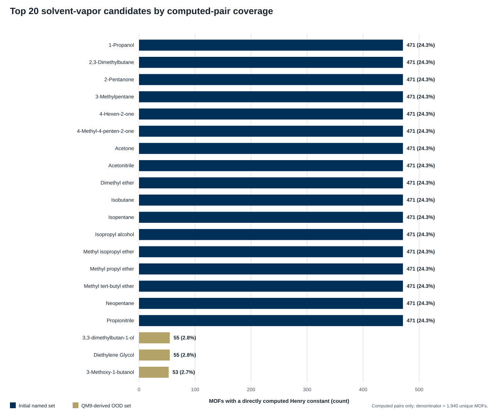

# Eight-gas ethylene-cracker coverage report

## Monday result

The approved process-gas panel is **fully aligned across 471 MOFs**: all eight gases have a directly computed Henry constant for the same MOF set. This produces **3,768 computed MOF–gas pairs** with no missing values and no duplicate keys.

The 471-MOF set covers **24.3%** of the **1,940 unique MOFs** in the deposited computed table. Because every gas has the same count, all eight tie for coverage rank 1; coverage does not distinguish among them.

## Approved target gases

| Coverage rank | Gas | Process role | Directly computed MOFs | Coverage of 1,940 MOFs | Median K | IQR | Exact zeros |
|---:|---|---|---:|---:|---:|---:|---:|
| 1 | Methane | Cracking by-product / fuel gas | 471 | 24.3% | 1.080e-05 | 1.497e-05 | 0 |
| 1 | Ethane | Primary feed / unconverted feed | 471 | 24.3% | 1.631e-04 | 4.726e-04 | 0 |
| 1 | Ethylene | Primary product | 471 | 24.3% | 7.980e-05 | 1.970e-04 | 0 |
| 1 | Propane | Alternate feed / unconverted co-feed | 471 | 24.3% | 1.309e-03 | 5.767e-03 | 0 |
| 1 | Propylene | Co-product | 471 | 24.3% | 9.388e-04 | 3.513e-03 | 0 |
| 1 | Isobutane | C4 light-end proxy | 471 | 24.3% | 3.778e-03 | 2.889e-02 | 6 |
| 1 | Isopentane | C5 / heavier-feed proxy | 471 | 24.3% | 1.716e-02 | 2.743e-01 | 10 |
| 1 | 2-Pentene | C5 olefin / cracked-product proxy | 471 | 24.3% | 4.055e-02 | 4.367e-01 | 1 |

`K` is the **linear Henry coefficient at 300 K** in **mol kg^-1 Pa^-1**. Medians and quartiles are pandas dataframe quantiles with linear interpolation over directly computed values only; exact deposited zeros are retained. The paper predicts `log10(K)` during machine learning, but the deposited `final.csv` stores the nonnegative linear `K` values used here.

## Interpretation

- **Core feed/product group:** methane, ethane, ethylene, propane, and propylene.
- **Coverage-matched C4/C5 proxies:** isobutane, isopentane, and 2-pentene. These provide heavier light-end contrast; they are not a claim that each is a dominant product in every cracker.
- **Outlet means a conditioned extractive sample:** the intended measurement location is a post-quench/sample-conditioned sidestream near 300 K, not direct MOF exposure to raw furnace coil effluent near 850 °C.
- The normalized 471 × 8 Henry matrix has **rank 8** but a condition number of **1000.4**. The strongest monotonic similarities are ethane/ethene (Spearman ρ = 0.995) and propane/propene (ρ = 0.990). This supports starting with 12 MOFs for redundancy and reducing only after mixture testing.

## Four bullets for Monday

- D-MOPH-25 contains **16,628 directly computed pairs**, **1,940 MOFs**, and **113 molecules** at **300 K**.
- The eight-gas ethylene-cracker panel yields a complete **471 MOFs × 8 gases = 3,768 pair** comparison matrix.
- The target separates feed/product markers (ethane/ethylene and propane/propylene) and adds methane plus three C4/C5 process-gas proxies.
- Next: select **12 MOFs**, test gas identification, composition drift, and product/feed ratios, then reduce the array if performance is retained.

## Boundaries and remaining inputs

- Computed pairs only: no ML-completed values are included.
- Henry constants are pure-component dilute-limit descriptors. Mixture-response assumptions, noise, competitive adsorption, humidity, and sensor transduction are not yet modeled.
- A percentage of the **true total outlet** requires concentrations for water, hydrogen, carbon monoxide, carbon dioxide, acetylene, and other stream species not in this eight-gas D-MOPH panel. Until then, an eight-gas-normalized percentage must be labeled as such.
- The next stage needs a representative post-quench outlet composition and operating ranges, an exact sample location, and a decision on whether to model only normal operation or also startup/upset states.

## Evidence

- Dataset and deposited `final.csv`: [D-MOPH-25 Zenodo record](https://zenodo.org/records/16754752)
- Units, 300 K calculation, and active-learning dataset description: [Choi, Sholl & Medford (2025)](https://doi.org/10.1088/2632-2153/ae0241)
- Ethylene-cracker process context: [U.S. EPA petrochemical technical support document](https://www.epa.gov/sites/default/files/2015-03/documents/subpartx-tsd-petrochem.pdf)
- Extractive furnace-effluent measurement context: [Siemens ethylene furnace-effluent analyzer note](https://cache.industry.siemens.com/dl/files/563/109770563/att_995347/v1/PIAAP-00002-0118-Ethylene.pdf)
